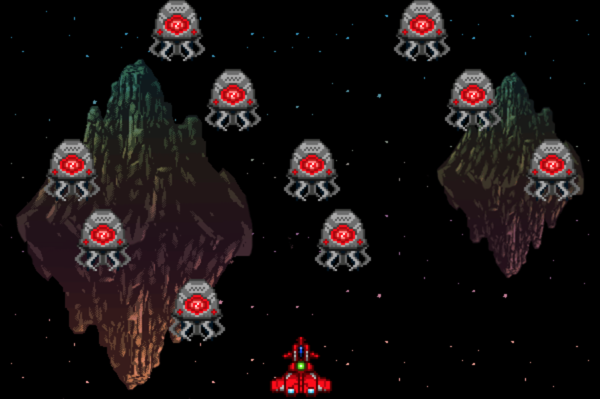
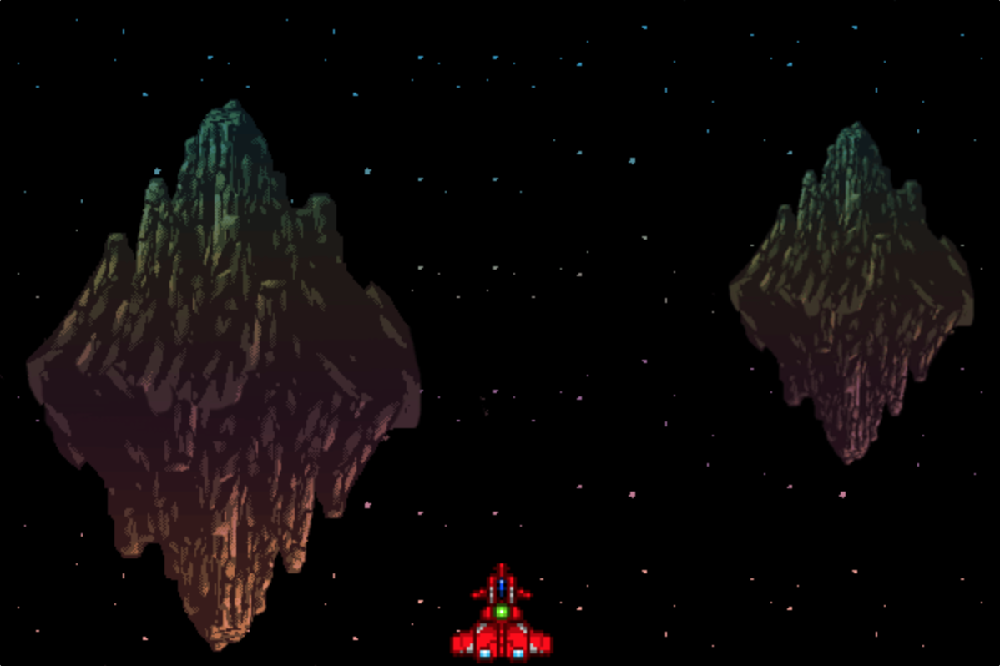

# ReasonML Workshop

Ce workshop a pour but de familiariser les participants avec le langage ReasonML en développant plusieurs parties d'un Space Invader !

_ReasonML_ est fortement inspiré de OCaml et donc par définition statiquement fortement typé ainsi que fonctionel.
ReasonML a été conçu afin d'être plus simple d'utilisation qu'OCaml et se rapprocher un peu plus de la syntaxe classique de JavaScript.
ReasonML est fortement lié à un autre projet nomé [Bucklescript](bucklescript.github.io]) qui sert justement à compiler du OCaml ou ReasonML en JavaScript.

## Pré-requis

* Un ordinateur... c'est mieux :)
* NodeJS & NPM installé
* Visual Studio Code
* _optionel mais recommandé_
  * [Merlin](https://reasonml.github.io/docs/en/extra-goodies.html#merlin) & ReasonML installé en global : <https://reasonml.github.io/docs/en/global-installation.html>
  * Le plugin ReasonML installé. cf. [Package ReasonML](https://github.com/reasonml-editor/vscode-reasonml)

## Démarrage



> Capitaine Kirk, les aliens débarquent et plusieurs systèmes de l'Enterprise NC-1701 sont hors service, nous avons besoin de vous !

Pour le réparer, il vous faudra d'abord récupérer les sources du centre de contrôle ici :

```bash
git clone git@github.com:js-republic/reason-ml-workshop.git
```

Vous pourrez ensuite le démarrer en rentrant dans le terminal à la racine du projet :

```bash
npm install
```

```bash
npm run init
```

```bash
npm start
```

> Ne vous déconseillons l'utilisation de `yarn`, car des participants précédents ont rencontré des problèmes avec et nous n'avons pas de `yarn.lock` vous garantissant la bonne version des dépendances.

Il ne vous restera qu'a ouvrir le panneau de contrôle (aka. le fichier `index.html`) dans votre navigateur.

Avant de vous lancer dans cette mission, prennez quelques minutes pour vous familiariser avec l'architecture du vaisseau et du langage ReasonML qui le compose.

## Informations générales

Structure de fichier :

```
src
├── Actions.re        <- Contient les différents type d'actions utilisables dans le système
├── Alien.re          <- Dessine les aliens
├── Alien_reducer.re  <- Reducer de l'état des aliens
├── Bg.re             <- Dessine les fonds d'écran
├── Colision.re       <- Permet de détecter les colisions
├── Constants.re      <- Contient les constantes comme la hauteur et la largeur de l'écran
├── Image.re          <- Fichier utilitaire servant à dessiner les images
├── Main.re           <- Point d'entrer et coeur du système
├── Reducer.re        <- Reducer principal de l'application
├── Ship.re           <- Dessine le vaisseau
├── Ship_reducer.re   <- Reducer de l'état du vaisseau
├── Shot.re           <- Dessine les projectiles du vaisseau
├── Shot_reducer.re   <- Reducer de l'état des projectiles
├── Stage.re          <- Gère les différents niveaux du jeux
├── Store.re          <- Store du jeux qui centralise l'intégralité des données
├── Types.re          <- Contient tous les types de l'application
└── index.html        <- Fichier index.html à ouvrir pour voir le jeux
__tests__
└── All_test.re       <- Contient tous les test unitaires
```

Le système de l'Enterprise NC-1701 est basé sur une architecture Flux/Redux couplée à une boucle de rendu. En clair, cela signifie que l'ensemble de tous les états (ex: position, taille, image) de chaque élement (Ship, Shot, Alien) sont regroupés dans un état principal, apppelé le `rootState` lui même stocké dans le `store` présent dans le fichier `Store.re`.
A chaque fois qu'un élément (Ship, Shot, Alien) désire changer une information qui le concerne, il doit dispatcher une `Action` (toutes les actions disponibles du système sont déclarées dans le fichier `Actions.re`) à l'aide de la fonction `dispatch` du fichier `Store.re`.

A chaque itération de la boucle de rendu, toutes les actions dispatchées depuis la dernière itération sont appliquées sur le reducers principaux, celui de Ship, de Shot et de Alien respectivement déclarés dans les fichiers `Reducer.re`, `Ship_reducer.re`, `Shot_reducer.re` et `Alien_reducer.re`. Les nouveaux états retournés par les reducers sont alors agrégés et construisent le nouvel état du `rootState` qui servira au rendu. Vous pourrez retrouver une explication sur la structure du `Store` dans le fichier du même nom.

Voici un aperçu globale du fonctionnement du système :

```
+-----------+
|           |
|           v
|    +------+-------+
|    |              |
|    | Pre-reducer  |
|    |              |
|    +------+-------+
|           |
|           v
|    +------+-------+
|    |              |
|    | Ship_reducer |
|    | Alien_reducer|
|    | Shot_reducer |
|    |              |
|    +------+-------+
|           |
|           v
|    +------+-------+
|    |              |
|    | Post-reducer |
|    |              |
|    +------+-------+
|           |
|           v
|    +------+-------+
|    |              |
|    |    Rendu     |
|    |              |
|    +------+-------+
|           |
+-----------+
```

> L'ensemble des plans du vaisseau ainsi que les types utilisés dans le système sont visibles dans le fichier `Types.re`. Un fichier bien utile à garder sous le coude pour ne pas ce perdre dans le système ;)

### TDD de l'espace !

Même en 2265 le TDD fait toujours des merveilles pour guider les hommes (et les femmes) vers la voie de la lumière !

Aussi, on nous signale que tous les vaisseaux de StarFleet sont équipés d'une suite de test pour résoudre tous les problèmes du vaisseau.

Vous retrouverez cette suite de test dans le fichier `__tests__/All_test.re`. Ces tests sont lancés dés que vous faite un `npm test` et leurs résultats sont disponibles dans la console.

Gardez ce fichier ouvert, il vous sera d'un grand secours tout au long de votre mission.

### Informations utiles sur ReasonML

### Les logs

Bien utile quand l'on veut déboguer, si vous voulez faire l'équivalent du `console.log` en ReasonMl vous pourrez appeler

```javascript
Js.log("Mon message que je veux afficher");
Js.log("Ma variable vaut " ++ maVariable); // Sous réserve que maVariable est bien un string
```

### Les Modules

En ReasoML, le concept de `Module` est omniprésent. Un `Module` représente un groupement de fonction, variable, type, etc. Bref, à peu prêt tout ce qu'on peut manipuler en ReasonML. Cela peut être vu comme un Namespace pour ceux qui en on déjà entendu parler d'en d'autres langages.

Chaque fichier ReasonML `*.re` créé implicitement un module du même nom, ainsi le fichier `Image.re` créé un module `Image`.
Pour utiliser quelque chose situé dans un autre fichier que celui dans lequel on est, on fera appel au module de cet autre fichier. Quelques exemples :

* Depuis `Alien.re` pour invoquer la fonction `draw` du fichier `Image` on écrira `Image.draw(...)`
* Depuis `Ship.re` pour typer le premier paramètre en `canvasContext` (définie dans le fichier `Types`) on écrira `Types.canvasContext`

Pour en savoir plus sur les modules, rendez-vous sur cette page :
<https://reasonml.github.io/docs/fr/module.html>

### Infos utiles :

* Rappel synthétique de la syntaxe ReasonML : <https://reasonml.github.io/docs/en/syntax-cheatsheet.html>
* Autre rappel : <https://github.com/arecvlohe/reasonml-cheat-sheet>
* API ReasonML : <https://reasonml.github.io/api/index.html>

> Pour les plus curieux : Sachez que les fichiers JavaScript générés depuis les sources ReasonML sont déposés dans le dossier `/lib/js/src`. Vous pourrez voir un peu à quoi ça ressemble une fois généré ;)

> Votre mission commence ici capitaine, nous comptons sur vous et votre fine équipe.

## GPS intergalactic brouillé - (Etape 1)

```
#option, #patternMatching, #labeledArguments
```

Votre première tâche va consister à réparer le GPS de l'Enterprise NC-1701. En effet pour l'instant le vaisseau n'apparait même pas sur la carte :


Rendez-vous dans le fichier `Ship.re`, pour réactiver le rendu de notre vaisseau sur la carte en implémentant la fonction `render`.

```reason
let render = (canvasContext: Types.canvasContext, state: Types.shipState) =>
  switch state.potentialSprite {
  | None => ()
  };
```

La fonction `render` prend en argument, en premier le contexte du canvas ([API Canvas Context](https://developer.mozilla.org/fr/docs/Web/API/CanvasRenderingContext2D)) et en deuxième, l'état courant du vaisseau visible dans le fichier `Types.re` à la [ligne 7](./src/Types.re#L7).

L'ingénieur en chef Scott, nous dit via le communicateur que l'image du vaisseau est réprésentée sous la forme d'une `option(Image)` (cf. [ligne 17](./src/Types.re#L17) du fichier `Types.re`). Une `option` est un type particulier présent nativement en ReasonML qu'on appelle un `Variant`. Il est en quelque sorte une coquille venant englober une variable dont on ignore si elle est valorisée ou non. Il permet de détecter la valorisation de manière plus élégante et plus puissante qu'un simple `maVar ? DO_SOME_THING() : DO_NOTHING()`.

Dans notre cas, il sagit d'une `option` d'`image` c'est donc en quelque sorte une coquille contenant potentiellement une image (ou pas).
`option` peut prendre soit l'état `Some` dans le cas où l'`option` contient une valeur, soit l'état `None` dans le cas où l'`option` ne contient rien.
Pour en savoir plus sur le type option, il nous envoi le Spatio-lien suivant : <https://reasonml.github.io/docs/en/variant.html#option>

Spock nous transmet un guide sur le `pattern matching`. Selon lui, le pattern matching est l'une des meilleures fonctionalités de ReasonML, et c'est grâce à elle que nous pourrons connaitre l'état de l'`option`. Il rajoute qu'actuellement `render` ne gère que l'état où il n'y rien dans l'`option` (aka `None`) et que la réparation de la fonction `render` consiste juste à ajouter le cas `Some` pour dessiner l'image. Doc :
<https://reasonml.github.io/docs/en/pattern-matching.html#usage>

> Une fois le cas `Some` traité, on nous conseille d'utiliser la fonction `draw` dans le fichier `Image.re` à la [ligne 20](./src/Image.re#L20). Cette fonction a la particularité d'utiliser les `labeled arguments` ou arguments nommés. Un argument nommé est un argument dont on précise le nom lors de l'appel de la fonction où il est déclaré. Cela permet, en autre, d'améliorer la clarté des paramètres donnés. Pour en savoir plus :(<https://reasonml.github.io/docs/en/function.html#labeled-arguments>).

<details>
<summary><i>Découvrer la solution ici</i></summary>
<p>
<pre>
let render = (canvasContext: Types.canvasContext, state: Types.shipState) =>
  switch state.potentialShipSprite {
  | Some(sprite) => Image.draw(canvasContext, sprite, ~x=state.x, ~y=state.y)
  | None => ()
  };
</pre>
</p>
</details>

---

## Remettez en marche les propulseurs auxiliaires - (Etape 2)

```
#patternMatching, #immutabilité, #record, #spread
```

Notre vaisseau est désormais visible mais reste cloué sur place et nous ne pouvons rien faire pour défendre la Fédération des planètes unies. Nous avons besoin de réparer les propulseurs auxiliaires.



> Spock nous rappel que notre vaisseau repose sur une architecture Flux et qu'il dispose d'actions listées dans le fichier `Actions.re`. Ces actions peuvent être dispatchées grâce à la fonction `dispatch` du module `Store` trouvable dans le fichier `Store.re`.

Pour que le vaisseau puisse se déplacer à nouveau, vous devez implémenter la fonction `onKeyDown` du fichier `Ship.re` pour y dispatcher les actions `GoLeft` ou `GoRight` du module `Actions` en fonction des touches du clavier.

```reason
let onKeyDown = (keyCode: string) : unit =>
  switch keyCode {
  | _ => ()
  };
```

Prêter bien attention aux résultats de la partie `Ship.re` des tests unitaires visibles dans la console. Ils vous indique le comportement attendu de `onKeyDown` de façon détaillé.

<details>
<summary><i>Découvrer la solution ici</i></summary>
<p>
<pre>
let onKeyDown = (keyCode: string) : unit =>
  switch keyCode {
  | "ArrowLeft" => Store.dispatch(Actions.GoLeft)
  | "ArrowRight" => Store.dispatch(Actions.GoRight)
  | _ => ()
  };
</pre>
</p>
</details>

---

Le reducer du vaisseau `Ship_reducer.re` doit lui aussi être mis à jour pour de gérer les actions `GoLeft` et `GoRight` afin d'appliquer une translation du vaisseau en `x` en fonction de la direction que vous avez dispatché...

> Les reducers de l'Enterprise ont la particularité de prendre en plus des habituelles paramètres `action` et `state` des reducers classiques, un paramètre supplémentaire appelé `elapsedTime`. Ce paramètre de type _float_ est en fait le temps passé depuis la dernière boucle de rendu. Le temps n'est en effet pas toujours le même entre deux boucles de rendu et par conséquent avoir le temps entre deux boucles permettra d'avoir des déplacements à vitesse constante.

```reason
let shipSpeed = 0.5;

let reducer = (elapsedTime: float, state: Types.shipState, action: Ations.all): Types.shipState =>
  switch action {
  | _ => state
  };
```

> _Un Rappel très important_ : Rappelez-vous que dans notre galaxie, les coordonées (0, 0) sont celles du coin haut gauche comme illustré ci-dessous :

```
(0,0)---------------->
|
|
|
|
|      (ship)
v
```

> Des fonctions `max` et `min` sont disponibles ainsi qu'un module `Constants` contenant la taille de la carte. Et rappelez-vous, vous devez toujours renvoyer une nouvelle instance du state jamais le modifier directement. Vous pouvez utiliser pour cela le Spread operator (<https://github.com/arecvlohe/reasonml-cheat-sheet#spread>).

Prêter bien attention aux résultats des tests unitaires visibles dans la console. Ils vous indique le comportement attendu de `reducer` de façon détaillé.

<details>
<summary><i>Découvrer la solution ici</i></summary>
<p>
<pre>
let shipSpeed = 0.7;
/**/
let reducer = (elapsedTime: float, state: Types.shipState, action: Actions.all) : Types.shipState =>
  switch action {
  | GoLeft => {...state, x: max(0., state.x -. elapsedTime *. shipSpeed)}
  | GoRight => {
      ...state,
      x: min(Constants.width -. state.width, state.x +. elapsedTime *. shipSpeed)
    }
  | _ => state
  };
</pre>
</p>
</details>

---

## Detection des aliens

```
#tuple, #patternMatching, #list, #spread
```

Les éclaireurs nous signalent que les Aliens disposent d'un système de camouflage les rendants indetectables à nos radars.

C'est la fin !

> Heureusement, oreilles pointues à une solution : A s'appuyant sur l'intelligence actificielle du vaisseau et des données des nombreuses batailles précédentes, Spock est arrivé à déterminer qu'elle sera la trajectoire exacte des Aliens pendant leur attaque. Il propose alors de simuler ces trajectoires dans l'écran de contrôle afin de ne plus être aveugle !

Le résultat de la simulation ressemblerait à cela :

```
(0,0)---------->
| x-O--O--O---+
|             |
| +--O--O--O--+
| |
| +-O--O--O---+
|             |
v             v
```

Pour implémenter cette simulation, nous allons modifier le radar à onde courte d'alien implémenté dans `Alien_reducer.re` en suivant ce que nous disent les tests unitaires :

```reason
let alienSpeed = 0.3;

let nextX = (elapsedTime: float, a: Types.alien) : float => 0.;

let isOnEdge = (newX: float, alien: Types.alien) : (bool, bool) => (true, true);

let alienStep = 70.;

let moveOnLeftEdge = (a: Types.alien) : Types.alien => a;

let moveOnRightEdge = (a: Types.alien) : Types.alien => a;

let moveAlien = (elapsedTime: float, a: Types.alien) : Types.alien => a;

let isStillInMap = (alien: Types.alien) => a;

let moveAliens = (aliens: list(Types.alien), elapsedTime: float) : list(Types.alien) => aliens;

let reducer = (elapsedTime: float, state: Types.alienState, action: Actions.all) : Types.alienState =>
  switch action {
  | Tick => {...state, aliens: moveAliens(state.aliens, elapsedTime)}
  | _ => state
  };
```

Pour implémenter la fonction `nextX`, vous aurez besoin de la fonction `float_of_int` pour convertir un `int` en `float`.

La fonction `isOnEdge` va retourner un type que nous n'avons pas encore utilisé pour le moment puisse qu'il s'agit d'un `tuple`, un Tuple de deux éléments pour être plus précis. Un Tuple représente un ensemble de variable, quand il s'agit d'un tuple de deux on dit même souvent que c'est une paire. `isOnEdge` retournera un tuple composé pour sa partie de gauche d'un boolean pour savoir si l'alien passé en paramètre touche le bord gauche, et d'un autre boolean pour sa partie de droite pour savoir si l'alien passé en paramètre touche le bord droit. Plus d'infos [ici](https://reasonml.github.io/docs/fr/tuple.html).

Pour implémenter `moveAlien`, vous ferez appel aux fonctions `nextX`, `isOnEdge`, `moveOnLeftEdge`, `moveOnRightEdge`.

> Bon à savoir : on peut faire du pattern matching sur un tuple ;-)

Pour implémenter `moveAliens` vous utiliserez un très belle syntaxe baptisée le `pipe operator` ainsi que l'API de `list` de ReasonML. Plus d'info ici :
<http://2ality.com/2017/12/functions-reasonml.html#the-reverse-application-operator>

<details>
<summary><i>Découvrer la solution ici</i></summary>
<p>
<pre>
let alienSpeed = 0.3;
/* */
let nextX = (elapsedTime: float, a: Types.alien) =>
  a.x +. elapsedTime *. alienSpeed *. float_of_int(a.direction);
/* */
let isOnEdge = (newX: float, alien: Types.alien) : (bool, bool) => (
  newX < 0.,
  newX +. alien.width > Constants.width
);
/* */
let alienStep = 70.;
/* */
let moveOnLeftEdge = (a: Types.alien) : Types.alien => {
  ...a,
  x: 0.,
  y: a.y +. alienStep,
  direction: 1
};
/* */
let moveOnRightEdge = (a: Types.alien) : Types.alien => {
  ...a,
  x: Constants.width -. a.width,
  y: a.y +. alienStep,
  direction: (-1)
};
/* */
let moveAlien = (elapsedTime: float, a: Types.alien) : Types.alien => {
  let x = nextX(elapsedTime, a);
  switch (isOnEdge(x, a)) {
  | (false, false) => {...a, x}
  | (true, _) => moveOnLeftEdge(a)
  | (_, true) => moveOnRightEdge(a)
  };
};
/* */
let isStillInMap = (alien: Types.alien) => alien.y < Constants.height;
/* */
let moveAliens = (aliens: list(Types.alien), elapsedTime: float) : list(Types.alien) =>
  aliens |> List.map(moveAlien(elapsedTime)) |> List.filter(isStillInMap);
/* */
let reducer = (elapsedTime: float, state: Types.alienState, action: Actions.all) : Types.alienState =>
  switch action {
  | Tick => {...state, aliens: moveAliens(state.aliens, elapsedTime)}
  | _ => state
  };
</pre>
</p>
</details>

## La collision !

```
#tuple, #list, #concatenation
```

L'entreprise est presque prêt ! Seul le système de detection des colisions reste inopérant. Appuyez sur la barre espace et vous constaterez le problème !


Regarder le fichier `Colision.re`, il contient la fonction `findNotCollided` responsable de prendre les aliens et les projectiles et de ne resortir que ceux qui n'ont pas eu de colision entre-eux. Comme pour les derniers chapitres, vous pourez compter sur les tests unitaires pour vous guider. Pour cette fonction nous devrons utiliser la fonction `fold_left` du module `List`, et de la concaténation de `list` grâce à l'operateur `@`.

<details>
<summary><i>Découvrer la solution ici</i></summary>
<p>
<pre>
let removeKilledBy = (shot: Types.shot, aliens: list(Types.alien)) : list(Types.alien) =>
  List.filter(
    (alien: Types.alien) =>
      ! (
        shot.x < alien.x
        +. alien.width
        && shot.x
        +. shot.width > alien.x
        && shot.y < alien.y
        +. alien.height
        && shot.height
        +. shot.y > alien.y
      ),
    aliens
  );
let findNotCollided =
    (aliens: list(Types.alien), shots: list(Types.shot))
    : (list(Types.alien), list(Types.shot)) => {
  let initValue: (list(Types.alien), list(Types.shot)) = (aliens, []);
  List.fold_left(
    ((aliensStillAlive, missedShots), shot: Types.shot) => {
      let newAliensStillAlive = aliensStillAlive |> removeKilledBy(shot);
      let isShotHit = List.length(newAliensStillAlive) != List.length(aliensStillAlive);
      let newMissedShot = isShotHit ? missedShots : missedShots @ [shot];
      (newAliensStillAlive, newMissedShot);
    },
    initValue,
    shots
  );
};
</pre>
</p>
</details>
